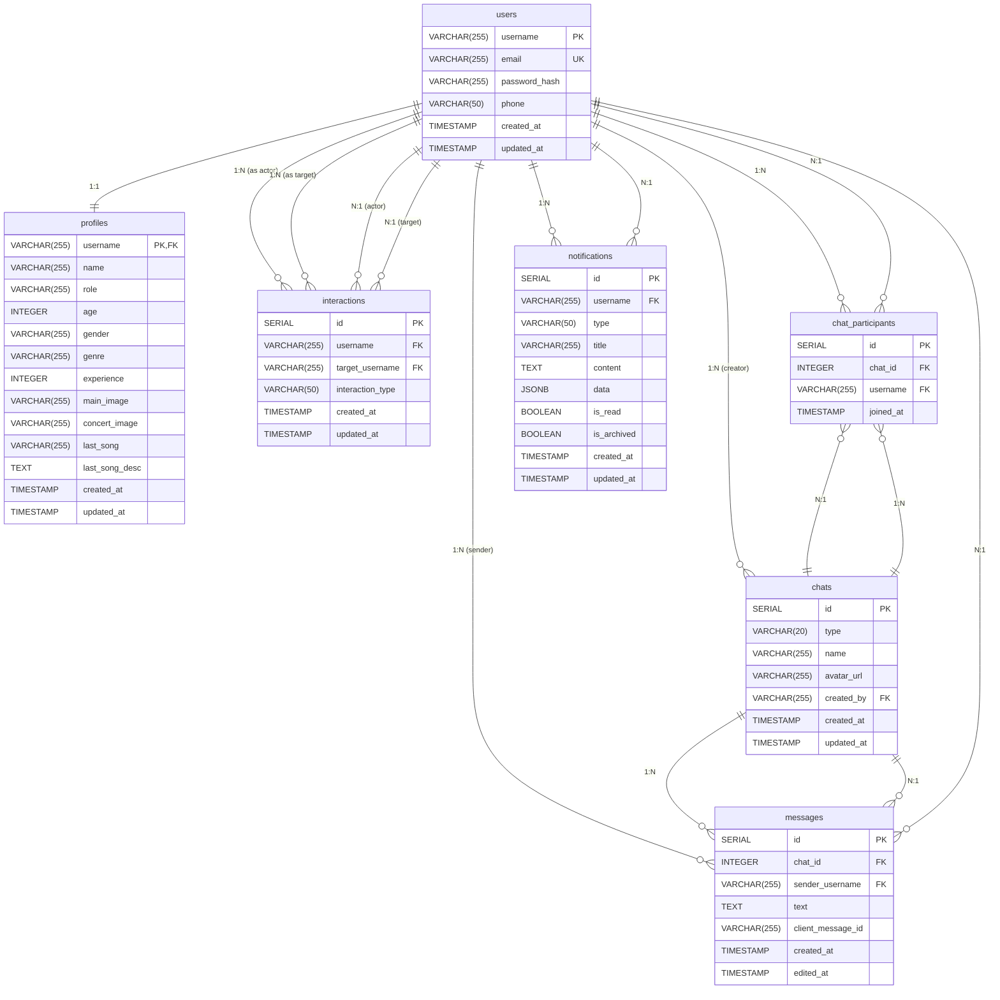

# Database Schema

## Tables and Relationships

## Table Details

### users

- **Purpose**: Authentication and basic user data
- **Primary Key**: username (3-30 chars, alphanumeric + underscores)
- **Constraints**: Unique email, username format validation
- **Fields**: username, email, password_hash, phone, timestamps

### profiles

- **Purpose**: Extended user profile information
- **Primary Key**: username (1:1 with users table)
- **Fields**: name, role, age, gender, genre, experience, images, music preferences

### interactions

- **Purpose**: User-to-user interactions (like, dislike, block)
- **Fields**: interaction_type, actor_username, target_username
- **Types**: 'like', 'dislike', 'block'

### chats

- **Purpose**: Conversation containers
- **Types**: 'dm' (direct message) or 'group'
- **Fields**: name, avatar_url, created_by

### chat_participants

- **Purpose**: Many-to-many relationship between users and chats
- **Fields**: chat_id, username, joined_at
- **Constraints**: Unique (chat_id, username) combination

### messages

- **Purpose**: Individual messages within chats
- **Fields**: text, client_message_id, created_at, edited_at
- **Features**: Edit support, client message ID for deduplication

### notifications

- **Purpose**: User notifications system
- **Fields**: type, title, content, data (JSONB), read/archived status
- **Features**: Flexible data storage, read/unread tracking

## Key Relationships

1. **users ↔ profiles**: 1:1 relationship (every user has one profile)
2. **chats ↔ chat_participants ↔ users**: Many-to-many for chat membership
3. **chats ↔ messages**: One-to-many (chat contains many messages)
4. **users ↔ notifications**: One-to-many (user receives many notifications)
5. **users ↔ interactions**: Two one-to-many relationships (actor and target)

## Constraints and Indexes

- **Username constraints**: 3-30 characters, alphanumeric + underscores only
- **Foreign keys**: All relationships properly constrained
- **Unique constraints**: email (users), (chat_id, username) (chat_participants)
- **Timestamps**: Automatic created_at/updated_at on all tables
- **Cascading deletes**: messages and chat_participants cascade on chat deletion
